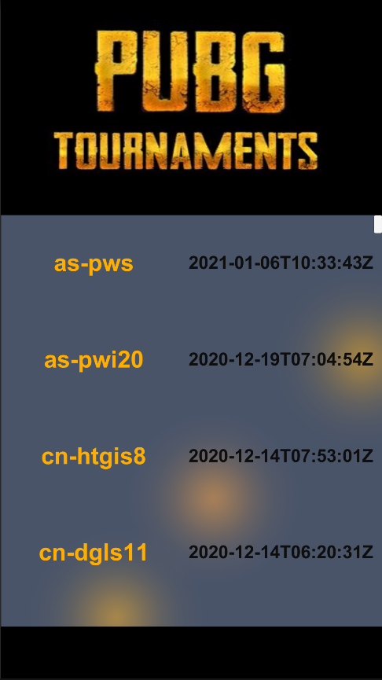

# Unity PUBG Tournaments API
An app that requests tournaments from the PUBG tournaments API and displays their ids and dates

## Info:

- <b>Unity Version:</b> 2020.1.2f1 (64-bit)
- <b>API Doc:</b> https://documentation.pubg.com/en/tournaments-endpoint.html
- <b>Android build:</b> Builds/Pubg-Tournaments.apk

## Screen:

